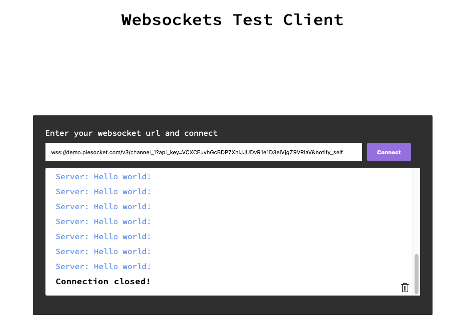

<div align="center">

# websocket-client

websocket-client with Angular UI.

[Getting started](#getting-started)


</div>

## Getting started

```shell
git clone https://github.com/rami-nk/websocket-client.git
cd websocket-client
npm install
npm run start or ng serve
```

Navigate to `http://localhost:4200/`.
